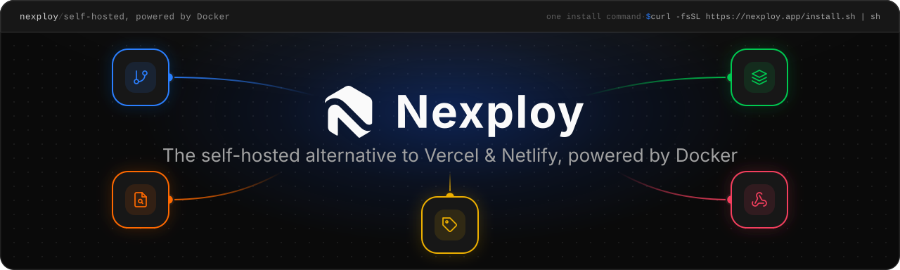

<p align="center">
  <a href="https://nexploy.app">
    
  </a>
</p>

<p align="center">
  Deploy applications from Git repositories to Docker containers with automatic HTTPS, real-time monitoring, and a modern interface.
</p>

<p align="center">
  <a href="https://nexploy.app">Nexploy app</a> ·
  <a href="https://docs.nexploy.app">Documentation</a>
</p>

---

## Features

| Feature | Description |
|---|---|
| **Git integration** | Deploy from GitHub (GitHub App), GitLab, Gitea, Bitbucket and Azure Repos — self-hosted GitLab/Gitea included — with automatically configured webhooks |
| **Build pipeline** | Durable node graph run by Inngest, with real-time per-node log streaming |
| **Visual pipeline editor** | Node-based editor (56 node types) to build custom deployment workflows |
| **Deployment stages** | Staging, production… each with its own pipeline, env variables, Docker host and versions |
| **Docker management** | Containers, images, volumes, networks and Docker Swarm from a single dashboard |
| **Multi-host environments** | Deploy to several Docker hosts — local socket, TCP, or TCP with TLS |
| **Organizations** | Group repositories per team — email invitations, organization roles on top of instance roles, and repository transfer between organizations |
| **Traefik reverse proxy** | Automatic routing, Let's Encrypt SSL and custom certificates |
| **Real-time monitoring** | Live container stats, build logs, Docker events and Traefik requests via SSE |
| **Encrypted environment variables** | AES-256-GCM encryption at rest |
| **In-browser terminal** | WebSocket-powered Docker container terminal |
| **Backups** | Scheduled Docker volume backups to S3-compatible storage |
| **Automatic cleanup** | Scheduled prune of images, volumes, containers and build cache |
| **Private registries** | Push and pull images from your own Docker registries |
| **Cloudflare DNS** | Manage the DNS records of your domains from the interface |
| **AI assistant** | Multi-provider chat wired to your resources through MCP tools |
| **Authentication** | Email/password, OAuth, TOTP 2FA with backup codes, and API keys |
| **Recovery CLI** | `@nexploy/cli` resets an admin password straight from the database when the app is down |
| **Multi-language** | English and French via `next-intl` |

## Tech Stack

| Layer | Technologies |
|---|---|
| **Frontend** | Next.js 16, React 19, Tailwind CSS, shadcn/ui, Zustand |
| **Backend** | Next.js Server Actions, Hono.js, Prisma 7, PostgreSQL 18 |
| **Auth** | Better Auth (email/password, OAuth, 2FA, API keys) |
| **Jobs** | Inngest (self-hosted, resumable build pipeline) |
| **AI** | Multi-provider AI SDK + MCP |
| **Infra** | Docker, Traefik v3, SSE, WebSocket |
| **Tooling** | pnpm 11 workspaces + Turborepo |

---

# Development setup

## Prerequisites

| Tool | Version | Why |
|---|---|---|
| **Node.js** | **22.13+** | pnpm 11 requires it (it loads `node:sqlite`) |
| **pnpm** | 11.9+ | `corepack enable` picks up the version pinned in `package.json` |
| **Docker** | with Compose v2 | Runs Postgres, Inngest and Traefik — and is what Nexploy deploys to |

```bash
corepack enable
node -v   # must be >= 22.13
```

## 1. Install dependencies

```bash
git clone https://github.com/Nexploy/nexploy.git
cd nexploy
pnpm install
```

## 2. Create the env files

```bash
cp apps/nexploy/.env.example    apps/nexploy/.env
cp apps/docker-api/.env.example apps/docker-api/.env
```

Two secrets have no default — generate them and paste them into `apps/nexploy/.env`:

```bash
openssl rand -hex 32   # -> BETTER_AUTH_SECRET
openssl rand -hex 32   # -> ENCRYPTION_KEY
```

`ENCRYPTION_KEY` also goes into `apps/docker-api/.env`, with the **same value** — docker-api uses it as the
internal secret when it calls back into nexploy to verify API keys.

Every other value already points at the dev stack (Postgres on `5433`, Inngest on `8288`).
Leave `NEXPLOY_API_KEY` empty in both `.env` files for now — step 5 produces it.

## 3. Start the infrastructure

```bash
docker compose -f infra/docker/docker-compose.dev.yml up -d
```

| Container | Port | Notes |
|---|---|---|
| PostgreSQL | `5433` | user / password / database: `nexploy` |
| Inngest dev server | `8288` | UI to inspect build jobs |
| Traefik | `80`, `443`, `8080` | `8080` is the dashboard |

Wait until Postgres reports `healthy`:

```bash
docker compose -f infra/docker/docker-compose.dev.yml ps
```

## 4. Run the database migrations

```bash
pnpm --filter=nexploy db:migrate:dev
```

## 5. Seed, and wire the internal API key

Nexploy and `docker-api` authenticate to each other with a shared **Better Auth API key**, sent as
`Authorization: Bearer` by nexploy and as `x-api-key` by docker-api — both sides read it from the exact same
env var, `NEXPLOY_API_KEY`. The seed creates it — along with the default local Docker environment — and prints it:

```bash
pnpm --filter=nexploy db:seed
```

```
NEXPLOY_API_KEY=nxp_xxxxxxxxxxxxxxxxxxxxxxxxxxxxxxxx
```

Copy that value into **both** env files, under the same variable name:

```env
# apps/nexploy/.env
NEXPLOY_API_KEY=nxp_xxxxxxxxxxxxxxxxxxxxxxxxxxxxxxxx

# apps/docker-api/.env
NEXPLOY_API_KEY=nxp_xxxxxxxxxxxxxxxxxxxxxxxxxxxxxxxx
```

> Re-running the seed **revokes and recreates** the key. If `docker-api` suddenly answers `401`, copy it again.
> In the Docker deployments this is automated: the app writes the key to a file and `docker-api` fetches it at boot.

## 6. Start the apps

```bash
pnpm dev            # nexploy + docker-api
```

| Service | URL |
|---|---|
| Web app | http://localhost:3000 |
| Docker API | http://localhost:3300 |
| Inngest dev UI | http://localhost:8288 |
| Traefik dashboard | http://localhost:8080 |

Open http://localhost:3000 — it redirects to `/setup`, where you create the first admin account.

### Running a single app

```bash
pnpm dev:nexploy      # Next.js only (port 3000)
pnpm dev:docker-api   # Docker API only (port 3300)
```

`docker-api` needs access to the Docker socket (`/var/run/docker.sock`). On macOS this works out of the box with
Docker Desktop, OrbStack or Colima — give the VM at least **4 GB of RAM**, the Next.js production build gets
OOM-killed below that.

## Troubleshooting

| Symptom | Cause |
|---|---|
| `docker-api` answers `401` on every route | `NEXPLOY_API_KEY` differs between the two `.env` files, or the seed has been re-run since |
| `EADDRINUSE: :::3300` | A previous `docker-api` is still alive — `lsof -nP -iTCP:3300 -sTCP:LISTEN` |
| Prisma cannot reach the database | The dev stack listens on **5433**, not 5432 |
| `pnpm lint` reports nothing | `next lint` was removed in Next 16 and no workspace declares a `lint` script yet — `pnpm types` is the check that runs |

---

## Commands

```bash
# Development
pnpm dev                                # nexploy + docker-api
pnpm dev:nexploy                        # Next.js only (port 3000)
pnpm dev:docker-api                     # Docker API only (port 3300)

# Build & checks
pnpm build                              # Build every workspace (Turborepo)
pnpm types                              # Type check every workspace
pnpm format                             # Format with Prettier

# Database (scoped to the nexploy app)
pnpm --filter=nexploy db:migrate:dev    # Create & apply a migration
pnpm --filter=nexploy db:migrate:prod   # Apply migrations (production)
pnpm --filter=nexploy db:migrate:only   # Create a migration without applying it
pnpm --filter=nexploy db:generate       # Regenerate the Prisma client
pnpm --filter=nexploy db:seed           # Seed + print the internal API key
pnpm --filter=nexploy db:studio         # Prisma Studio
pnpm --filter=nexploy db:reset          # Drop, re-migrate, re-seed

# Tests
pnpm test:api                           # Vitest (nexploy app)
```

## Project structure

```
nexploy/
├── apps/
│   ├── nexploy/              # Next.js app — UI, server actions, orchestration
│   │   ├── prisma/           # Schema, migrations, seed
│   │   ├── server.ts         # Custom server (WebSocket proxy to docker-api)
│   │   └── docker/           # Assets used by the production image
│   └── docker-api/           # Hono.js API — every Docker operation
├── packages/
│   ├── ui/                   # Shared shadcn/ui components
│   ├── schemas-zod/          # Zod validation schemas
│   ├── typescript-interface/ # Shared TypeScript types
│   ├── shared/               # Shared utilities
│   ├── i18n/                 # Internationalization (en, fr)
│   └── typescript-config/    # Shared TypeScript config
├── infra/
│   ├── docker/               # Compose files (dev, test, prod)
│   └── traefik/              # Traefik static + dynamic configuration
└── scripts/                  # changelog generation, tooling helpers
```

Each dependency is declared in the workspace that actually imports it; the root `package.json` only carries the
cross-cutting tooling (Turborepo, TypeScript, Biome).

## Architecture

### Deployment flow

```
Git push → Webhook → Inngest build pipeline → docker-api → Container + Traefik route
```

### Build pipeline

A build has no fixed step list: Inngest executes the **node graph** configured for the stage being deployed,
one Inngest step per node. The graph is snapshotted onto the build when it starts, so editing the pipeline
never rewrites past builds. Statuses are `QUEUED → BUILDING → COMPLETED / FAILED / CANCELLED`, plus a
per-node status and duration streamed live onto the graph.

56 node types cover cloning, building, deploying, tagging, pushing to a registry, managing domains, fetching
secrets, backing up volumes, scanning images, notifying and more, wired together with conditions and field
references. Two starting templates ship with the editor: Dockerfile
(`clone-repository → build-docker-image → create-container`) and Docker Compose
(`clone-repository → validate-compose → deploy-compose → clean-workdir`, with a `save-version` branch).

### Permission model

Two role systems apply to every action, and both must allow it:

| Level | Roles | Scope |
|---|---|---|
| **Instance** | `guest`, `developer`, `admin` | Users, Traefik, registries, SSL certificates, backups, settings |
| **Organization** | `owner`, `admin`, `member` | Repositories, builds, pipelines, env variables, domains, containers of one organization |

The instance role authorizes a *type* of action, the organization role grants access to the *specific*
resource. An instance `admin` reaches every organization so support operations stay possible.

### Traefik configuration

Traefik's static and dynamic configuration is not shipped statically — the app generates it on boot when it
doesn't already exist, and never overwrites an existing one, so manual customizations survive. The same
mechanism serves `install.sh` and `docker-compose` deployments.

### Real-time updates

```
Docker events → State manager → SSE → Zustand store → React UI
```

A single `EventSource` connection multiplexes every channel (containers, images, builds, Traefik requests…).

### Server actions vs API routes

Mutations go through `next-safe-action` server actions; **every read is a Next.js API route**. Client components
call `fetch('/api/...')` instead of a server action.

## Production deployment

On any machine with Docker:

```bash
curl -fsSL https://nexploy.app/install.sh | sh
```

Nothing is cloned and nothing is compiled — the installer pulls the published images
(`nexploy/nexploy` and `nexploy/docker-api`), so a fresh install takes about a minute.

It installs Docker if needed, asks for your domain and a Let's Encrypt email (or lets you skip both and run on
the server's bare IP over plain HTTP — see below), generates every secret and passes it straight to the
containers (nothing is written in clear text on the host disk), writes the Traefik configuration, then starts
five containers:

| Container | Role |
|---|---|
| `nexploy_traefik` | Reverse proxy, TLS, ports 80/443 |
| `nexploy_app` | The application (runs migrations and the seed on first boot) |
| `nexploy_docker_api` | Docker operations |
| `nexploy_postgres` | Database |
| `nexploy_inngest` | Build pipeline jobs |

Requirements: run the script as **root** (it manages Docker and writes to `/etc/nexploy`), and ports **80** and
**443** free and reachable. If you use a domain, DNS must point at the machine before the install finishes —
Let's Encrypt uses an HTTP challenge to issue the certificate.

### Installing without a domain (IP only)

No domain yet? Leave the domain prompt empty (or set `NEXPLOY_NO_DOMAIN=true` for a non-interactive install)
and the installer detects the server's public IP and serves Nexploy over plain HTTP instead — no Let's Encrypt,
no email needed:

```bash
NEXPLOY_NO_DOMAIN=true sh -c "$(curl -fsSL https://nexploy.app/install.sh)"
```

Plain HTTP means no certificate — handy to get started, not recommended long term. You can switch to a real
domain with HTTPS at any time, either from **Admin → Settings** in the app (which recreates the app container
and restarts Traefik with the new settings, no reinstall) or manually. Remember to update the OAuth redirect
URL at your Git provider too.

### Non-interactive install

```bash
NEXPLOY_DOMAIN=nexploy.example.com NEXPLOY_EMAIL=you@example.com \
  sh -c "$(curl -fsSL https://nexploy.app/install.sh)"
```

| Variable | Default | Purpose |
|---|---|---|
| `NEXPLOY_DOMAIN` | *(prompted)* | Domain the app is served on |
| `NEXPLOY_EMAIL` | *(prompted if a domain is set)* | Let's Encrypt contact address |
| `NEXPLOY_NO_DOMAIN` | `false` | Set to `true` to skip the domain and serve over the server's IP (plain HTTP) |
| `NEXPLOY_VERSION` | *(latest release)* | Image tag to deploy, e.g. `v1.0.0` |
| `NEXPLOY_DIR` | `/etc/nexploy` | Where secrets and Traefik config live |
| `NEXPLOY_REPO` | `Nexploy/nexploy` | GitHub repo used to resolve the latest release |

### Upgrading

```bash
curl -fsSL https://nexploy.app/install.sh | sh -s upgrade
```

The upgrade pulls the requested version and recreates the containers. Your secrets, database and domain are
untouched — re-running the installer never regenerates them.

If you are already on the latest version, the command does nothing. To force the containers to be recreated
even without a version change (useful after a container misbehaves), add `--force`:

```bash
curl -fsSL https://nexploy.app/install.sh | sh -s upgrade --force
```

### Uninstalling

```bash
curl -fsSL https://nexploy.app/install.sh | sh -s uninstall
```

> **Destructive.** This deletes your database, your deployment metadata and every generated secret, with no way
> back. You are asked to confirm by typing `remove`.

### Managing the instance

```bash
docker logs -f nexploy_app          # application logs
docker restart nexploy_app          # restart the app
docker ps --filter name=nexploy_    # every Nexploy container
```

> **Don't remove the containers carelessly.** Your secrets — including `ENCRYPTION_KEY`, which decrypts your
> environment variables — are not stored anywhere on the host disk; they only live in the containers'
> environment (`docker inspect nexploy_app`). Removing the containers without having backed those values up
> makes them unrecoverable. Only `/etc/nexploy/cli.env` persists on disk, and it holds nothing but the hash of
> the `nexploy-cli` recovery key.

## Environment variables

Day-to-day configuration lives in `.env` files, documented inline:

- [`apps/nexploy/.env.example`](apps/nexploy/.env.example) — app URL, auth, database, encryption key, Inngest, Traefik paths, AI providers
- [`apps/docker-api/.env.example`](apps/docker-api/.env.example) — port, Docker socket, and the shared internal API key

The tables below cover variables that only apply to **production** (`install.sh`) deployments. `install.sh`
sets them itself on `docker run`, so they're absent from the `.env.example` files above — listed here because
they came up while debugging the upgrade flow (network aliases/healthchecks dropped on container recreation,
maintenance page shown on the wrong entrypoint).

### `docker-api`

| Variable | Default | Purpose |
|---|---|---|
| `TRAEFIK_CONTAINER_NAME` | `nexploy_traefik` | Container name used for Traefik health checks and restarts |
| `TRAEFIK_NETWORK_NAME` | `nexploy_traefik_network` | Edge network shared with Traefik |
| `TRAEFIK_STATIC_CONFIG_PATH` | `/etc/nexploy/traefik/traefik.yml` | Path to Traefik's static config (read to detect available entrypoints) |
| `NEXPLOY_APP_CONTAINER_NAME` | `nexploy_app` | Container recreated on every app upgrade |
| `DOCKER_API_CONTAINER_NAME` | `nexploy_docker_api` | docker-api's own container name, recreated by the upgrader on every upgrade |
| `UPGRADER_CONTAINER_NAME` | `nexploy_upgrader` | Helper container that recreates both `nexploy_app` and `nexploy_docker_api` during an upgrade |
| `NEXPLOY_IMAGE_REPOSITORY` | `nexploy/nexploy` | Image repository pulled when upgrading the app |
| `DOCKER_API_IMAGE_REPOSITORY` | `nexploy/docker-api` | Image repository pulled when upgrading docker-api |
| `NEXPLOY_GITHUB_REPO` | `Nexploy/nexploy` | Repository checked for the latest available release/version |
| `NEXPLOY_APP_NETWORK_ALIAS` | `nexploy` | Network alias re-applied to `nexploy_app` on every recreation — lets docker-api resolve it as `http://nexploy:3000` |
| `DOCKER_API_NETWORK_ALIAS` | `docker-api` | Network alias re-applied to `nexploy_docker_api` on every recreation — lets the app resolve it as `http://docker-api:3300` |
| `SELF_UPGRADE_TARGET_IMAGE` | *(unset)* | docker-api image the upgrader recreates `nexploy_docker_api` with. Set only on the `nexploy_upgrader` container — never set manually |
| `SELF_UPGRADE_CONTAINER_NAME` | *(unset)* | docker-api container the upgrader recreates. Set only on the `nexploy_upgrader` container — never set manually |
| `SELF_UPGRADE_APP_TARGET_IMAGE` | *(unset)* | App image the upgrader recreates `nexploy_app` with. Set only on the `nexploy_upgrader` container — never set manually |
| `SELF_UPGRADE_APP_CONTAINER_NAME` | *(unset)* | App container the upgrader recreates. Set only on the `nexploy_upgrader` container — never set manually |

### `nexploy` app

| Variable | Default | Purpose |
|---|---|---|
| `TRAEFIK_USE_TLS` | `true` | Whether Traefik terminates TLS. Controls which entrypoint (`web` vs `websecure`) receives the maintenance-page override during an upgrade, and which static config template is rendered on first boot |
| `ACME_EMAIL` | *(unset)* | Let's Encrypt contact email, required when `TRAEFIK_USE_TLS=true` and `traefik.yml` doesn't already exist |
| `TRAEFIK_TEMPLATES_DIR` | `apps/nexploy/traefik-templates` (relative to cwd) | Where the Traefik dynamic-config templates are seeded from on first boot |
| `NEXPLOY_API_KEY_FILE` | `/tmp/nexploy-api-key` | Temp file the seed writes the plaintext internal API key to; read once by `entrypoint.sh` |

## Security

- Environment variables encrypted at rest (AES-256-GCM)
- OAuth tokens stored encrypted and refreshed automatically
- Git provider app credentials (client IDs, secrets, GitHub App private keys) encrypted at rest
- Webhook secrets validate Git provider callbacks
- Service-to-service calls authenticated with a Better Auth API key
- CSRF protection and session-based authentication
- Every resource access checked against both the instance role and organization membership

### Recovery CLI

`@nexploy/cli` talks **directly to the instance's Postgres database**, not to the app's API, so it still works
when `nexploy_app` is down, misconfigured, or its admin password is lost:

```bash
npm install -g @nexploy/cli
```

It must run on the server as root — it reads the Postgres password and address from
`docker inspect nexploy_postgres` (nothing is duplicated on disk) and `/etc/nexploy/cli.env`, which holds only
the hash of its recovery key.

## Contributing

1. Fork the repository and create a feature branch
2. Run `pnpm types` before committing
3. Add every new user-facing string to **both** the `en` and `fr` locales in `packages/i18n`
4. Open a Pull Request

## Acknowledgments

[Next.js](https://nextjs.org/) · [shadcn/ui](https://ui.shadcn.com/) · [Prisma](https://www.prisma.io/) · [Better Auth](https://www.better-auth.com/) · [Inngest](https://www.inngest.com/) · [Traefik](https://traefik.io/) · [Hono](https://hono.dev/)
